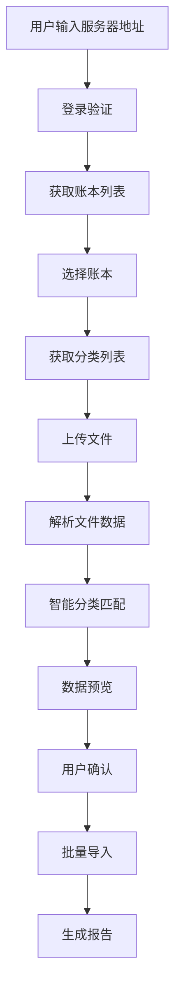

# 导入交易记录网页 - 架构规划

## 项目概述
开发一个纯静态网页应用，用于将第三方记账数据导入到记账系统中。应用使用LocalStorage进行数据持久化，支持多种数据格式导入和智能分类匹配。

## 系统架构

### 1. 前端架构

#### 技术栈
- **核心框架**: Vue 3 + TypeScript
- **构建工具**: Vite
- **UI组件库**: Element Plus
- **状态管理**: Pinia
- **文件处理**: SheetJS (支持Excel/CSV读取)
- **数据存储**: LocalStorage + sessionStorage
- **HTTP客户端**: Axios
- **文件下载**: FileSaver.js

#### 模块架构
```
src/
├── components/           # 组件目录
│   ├── common/          # 通用组件
│   ├── import/          # 导入相关组件
│   └── preview/         # 预览相关组件
├── stores/              # 状态管理
├── utils/               # 工具函数
├── types/               # TypeScript类型定义
├── api/                 # API接口封装
└── views/               # 页面视图
```

### 2. 后端API依赖

基于现有API架构，需要使用以下接口：

#### 认证相关
- `POST /auth/login` - 用户登录
- `GET /auth/check` - 检查认证状态

#### 账本管理
- `GET /api/account-books` - 获取用户账本列表
- `GET /api/account-books/default` - 获取默认账本
- `GET /api/account-books/:id` - 获取特定账本信息

#### 分类管理
- `GET /api/categories` - 获取分类列表

#### 预算管理
- `GET /api/budgets` - 获取预算列表
- `POST /api/budgets` - 创建新预算
- `GET /api/budgets/by-date` - 根据日期获取预算

#### 交易记录
- `POST /api/transactions` - 创建交易记录
- `POST /api/transactions/import` - 批量导入交易记录

### 3. 数据流架构



## 核心功能模块

### 1. 服务器配置模块
- 官方服务器预设
- 自定义服务器配置
- 连接状态检测
- 配置数据持久化

### 2. 身份认证模块
- 用户登录表单
- Token管理
- 会话保持
- 权限验证

### 3. 账本管理模块
- 账本列表展示
- 账本选择
- 账本信息显示

### 4. 文件处理模块
- 示例文件下载
- 文件上传与解析
- 数据格式验证
- 错误处理

### 5. 智能分类模块
- 分类规则配置
- 模糊匹配算法
- 分类映射表
- 手动调整功能

### 6. 数据预览模块
- 表格数据展示
- 分页处理
- 数据编辑
- 验证提示

### 7. 预算管理模块
- 预算匹配逻辑
- 自动创建预算
- 预算关联设置

### 8. 导入执行模块
- 批量数据提交
- 进度显示
- 错误处理
- 结果反馈

### 9. 报告生成模块
- 导入统计
- 成功/失败明细
- 数据导出

## 数据存储设计

### LocalStorage结构
```typescript
interface StorageData {
  serverConfig: {
    type: 'official' | 'custom';
    customUrl?: string;
    lastUsed: string;
  };
  userSession: {
    token?: string;
    refreshToken?: string;
    userInfo?: UserInfo;
    accountBooks?: AccountBook[];
    categories?: Category[];
    selectedAccountBookId?: string;
  };
  importSession: {
    fileData?: ImportRecord[];
    mappingConfig?: CategoryMapping[];
    previewData?: PreviewData;
    importProgress?: ImportProgress;
  };
  appSettings: {
    language: string;
    theme: string;
    autoSave: boolean;
  };
}
```

## 安全考虑

### 1. 数据安全
- 敏感数据加密存储
- Token定期刷新
- 自动清理过期数据

### 2. API安全
- HTTPS强制使用
- 请求超时设置
- 错误信息脱敏

### 3. 文件安全
- 文件类型验证
- 文件大小限制
- 恶意内容检测

## 性能优化

### 1. 文件处理
- 大文件流式处理
- 分批数据导入
- 进度实时反馈

### 2. UI性能
- 虚拟滚动
- 懒加载
- 防抖处理

### 3. 网络优化
- 请求合并
- 缓存策略
- 重试机制

## 错误处理策略

### 1. 网络错误
- 连接超时重试
- 网络状态检测
- 离线模式支持

### 2. 数据错误
- 格式验证
- 数据修复建议
- 错误日志记录

### 3. 用户体验
- 友好错误提示
- 操作撤销
- 数据恢复机制 